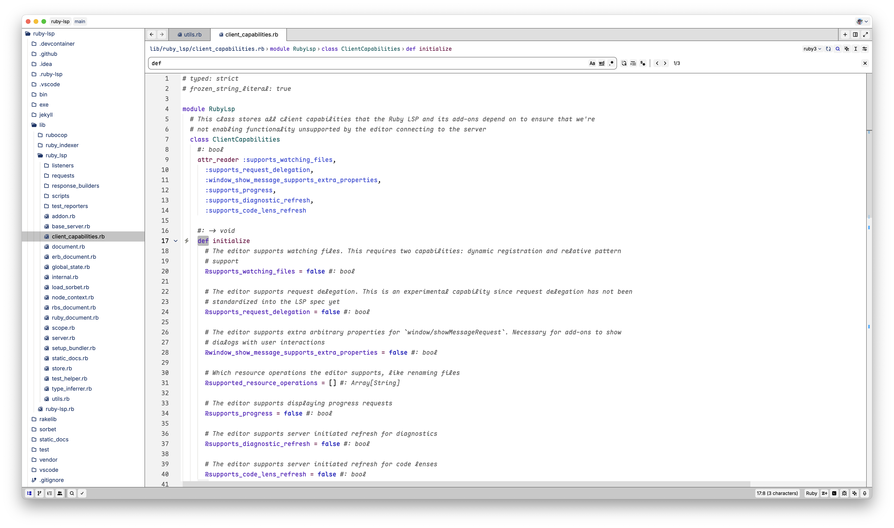
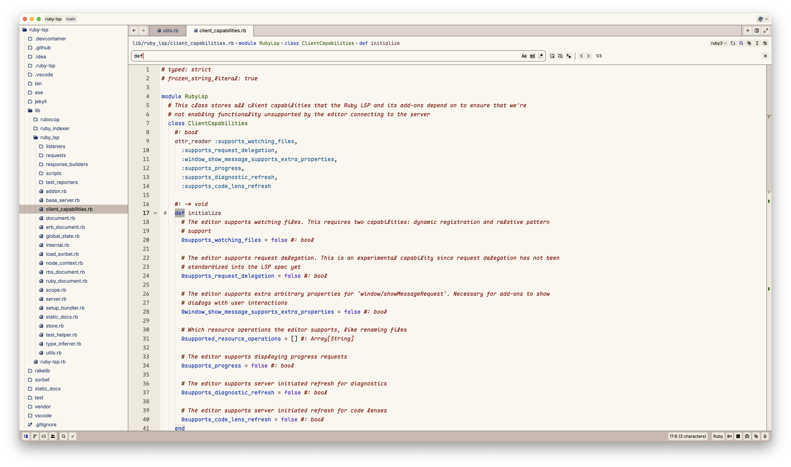
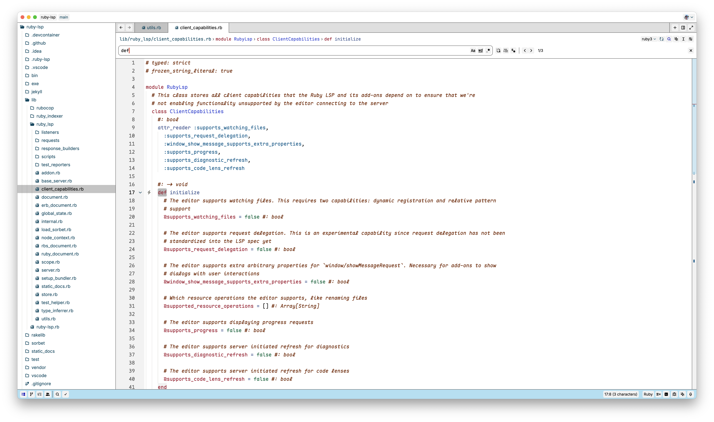
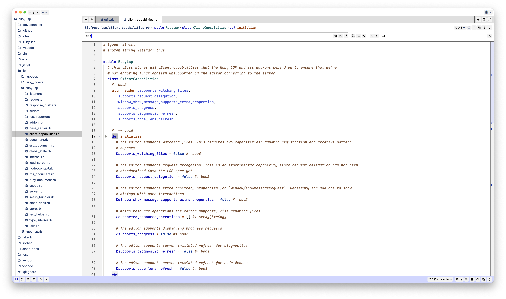
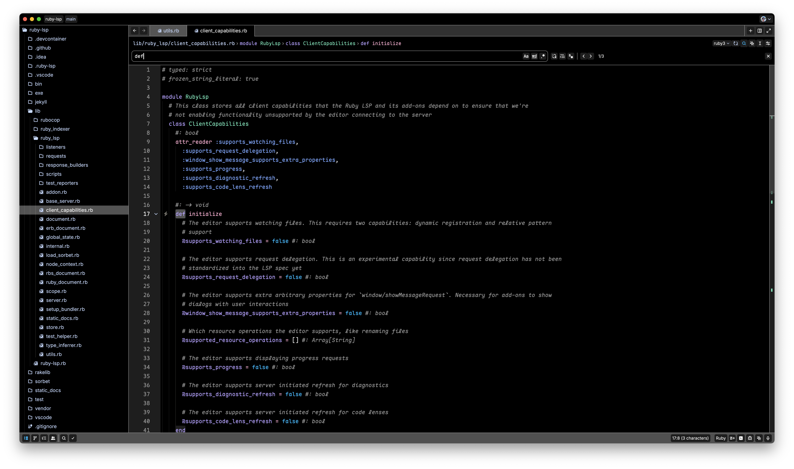
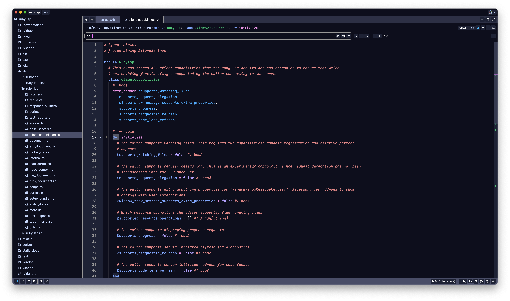
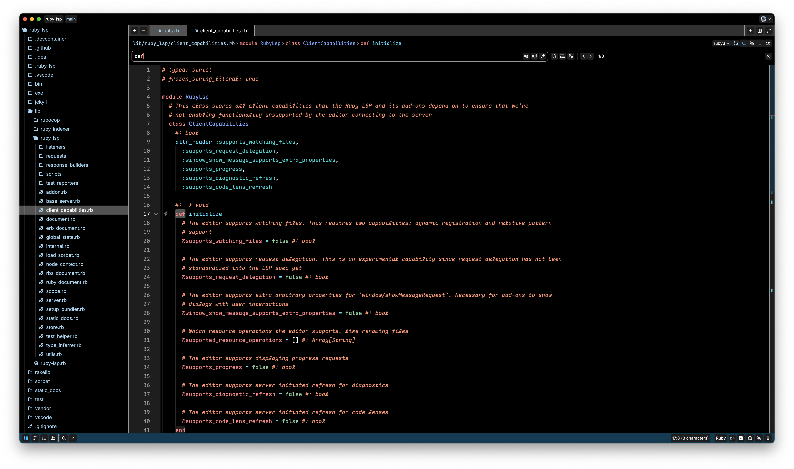
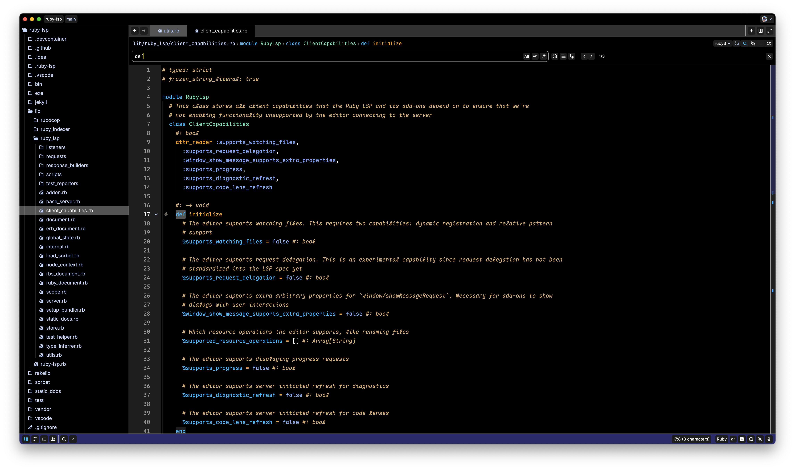

# Modus Themes for Zed

Highly accessible themes for [Zed](https://zed.dev), conforming with
the highest standard for color contrast between background and foreground values
([WCAG AAA](https://www.w3.org/WAI/WCAG21/Understanding/contrast-enhanced.html)). This
is a Zed port of the original [Modus Themes](https://protesilaos.com/emacs/modus-themes) built for
[GNU Emacs](https://www.gnu.org/software/emacs/).

## Overview

The Modus Themes are designed with accessibility and readability as primary goals. With a minimum contrast ratio of 7:1 between foreground and background elements, they reduce eye strain during long coding sessions and ensure optimal readability for all users, including those with visual impairments.

## Installation

In the command palette, choose `zed: extensions` then search for `modus-themes`.

## Features

- **WCAG AAA Compliance**: All color combinations meet or exceed the 7:1 contrast ratio required for WCAG AAA certification
- **Multiple Variants**: Light and dark base themes (Operandi and Vivendi), plus specialized variants for different color vision deficiencies
- **Carefully Designed Syntax Highlighting**: Balanced and consistent highlighting that enhances code readability
- **Optimized Terminal Support**: Colors work well in both GUI and terminal environments
- **Accessibility First**: Designed for users with color vision deficiencies or other visual accessibility needs


## Screenshots

### Modus Operandi (Light Theme)



#### Modus Operandi Tinted



#### Modus Operandi Tritanopia



#### Modus Operandi Deuteranopia



### Modus Vivendi (Dark Theme)



#### Modus Vivendi Tinted



#### Modus Vivendi Tritanopia



#### Modus Vivendi Deuteranopia



## Theme Variants Explained

- **Operandi**: Light theme with optimal contrast
- **Vivendi**: Dark theme with optimal contrast
- **Tinted**: Variants with slightly colored backgrounds for a softer look
- **Tritanopia**: Specifically designed for users with blue-yellow color blindness
- **Deuteranopia**: Optimized for users with red-green color blindness (specifically deuteranopia)

## Development

### Prerequisites

- [mise](https://mise.jdx.dev) for building the themes

### Build Process

1. Clone this repository:
   ```
   git clone https://github.com/vitallium/zed-modus-themes.git
   cd zed-modus-themes
   ```

2. Build the themes:
   ```
   mise build
   ```
   This process will compile the theme files and prepare them for installation.

## Configuration

### Disabling bold fonts

Use [Zed's experimental feature](https://zed.dev/docs/themes#theme-overrides) to override parts of the current theme:

```jsonc
"experimental.theme_overrides": {
  "syntax": {
    "keyword": {
      "font_weight": 400
    },
    "title": {
      "font_weight": 400
    },
    "type": {
      "font_weight": 400
    },
    "variable.special": {
      "font_weight": 400
    }
  }
}
```

## Acknowledgements

- [Modus Themes](https://protesilaos.com/emacs/modus-themes): Original Modus Themes for
  GNU Emacs
- [Modus Themes for Neovim](https://github.com/miikanissi/modus-themes.nvim): Neovim theme used for
  inspiration and as a template
